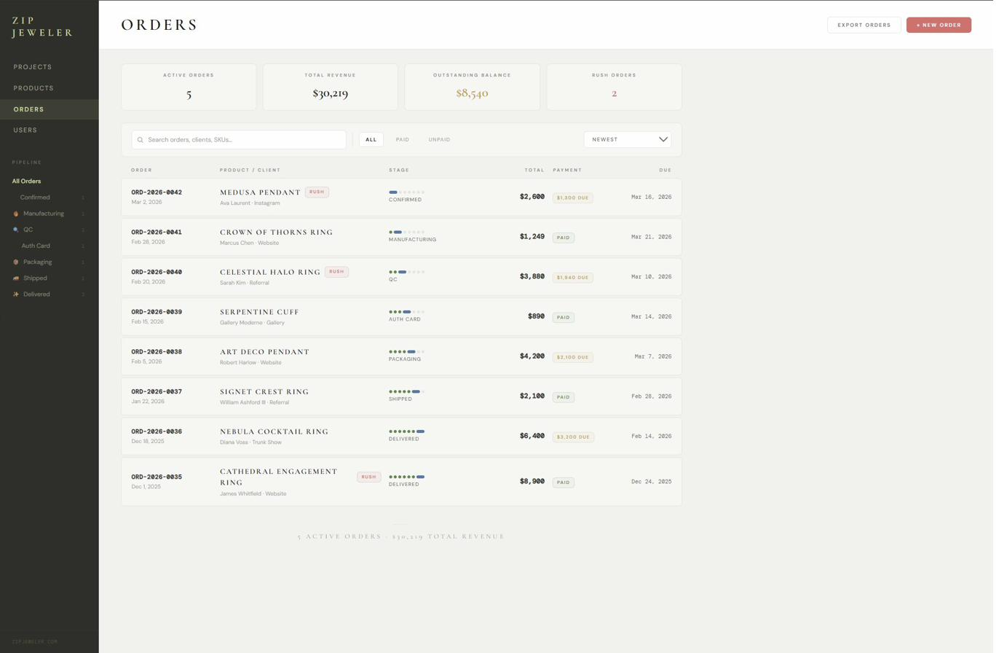
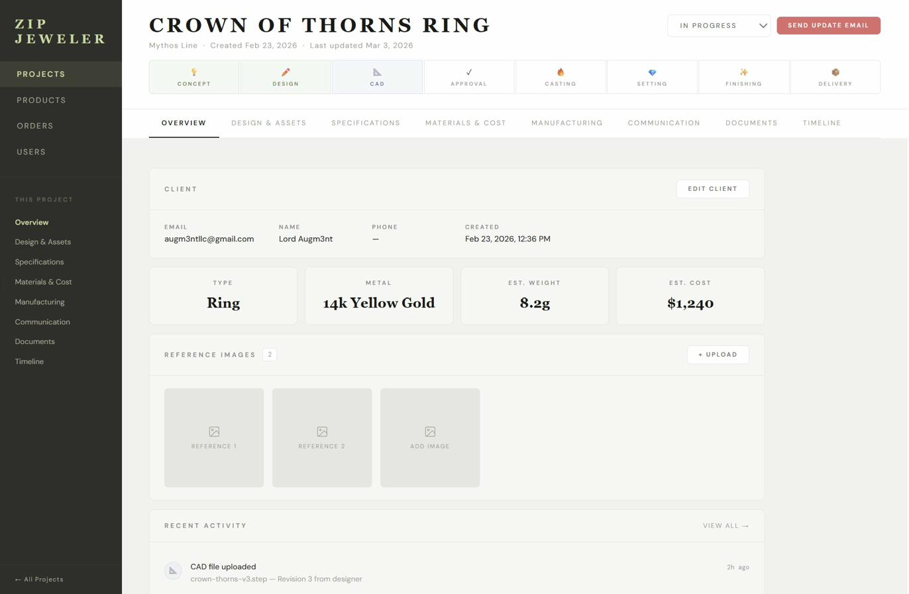
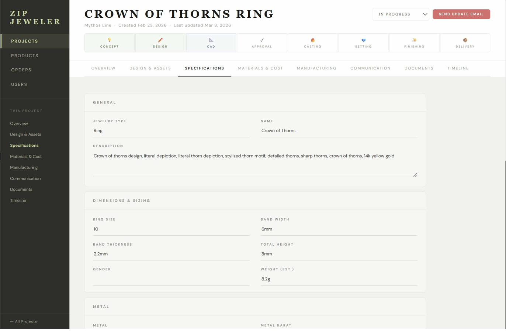
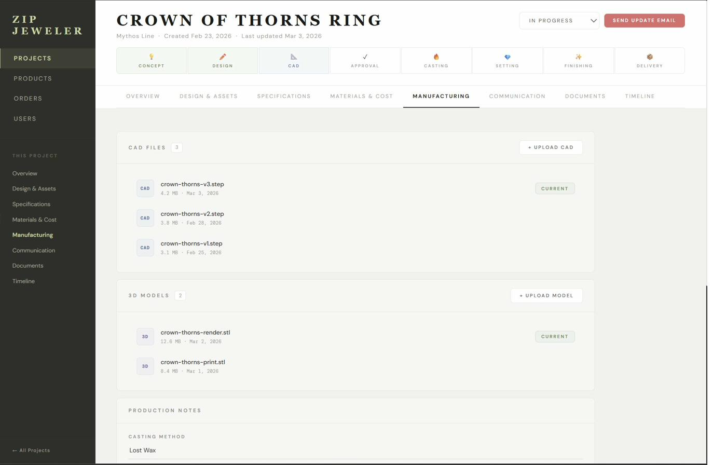
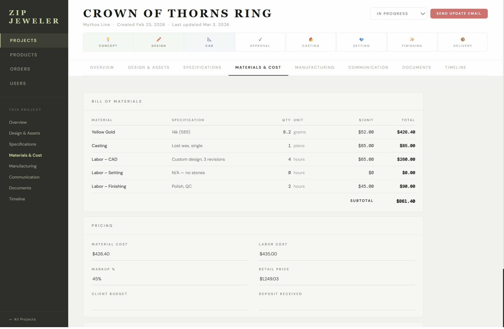
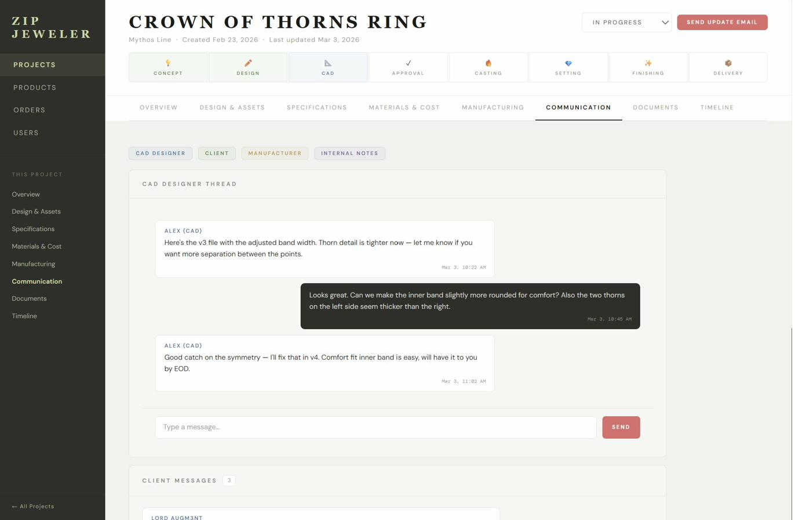
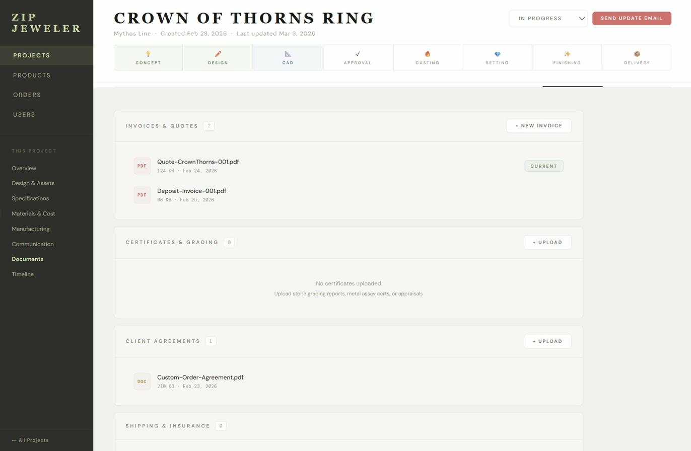
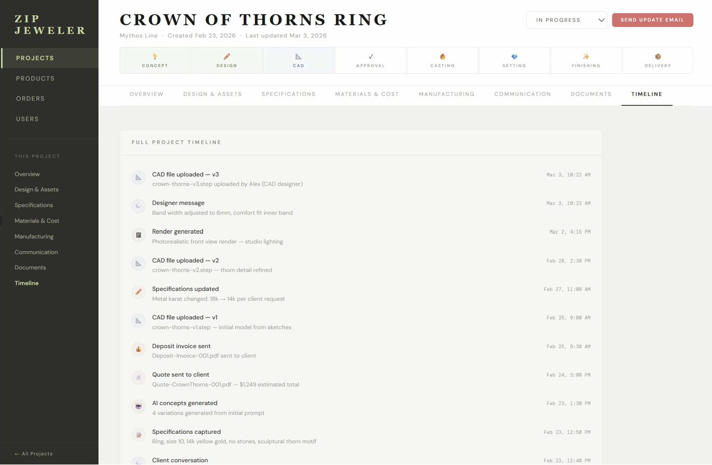

# ZipJeweler

A production-ready UI prototype for a custom jewelry management platform — built for jewelers who want to manage projects, orders, products, and AI-assisted design in one place.

## What's Inside

Six fully-built React component prototypes (~4,835 lines of UI):

| Component | Description |
|-----------|-------------|
| `Dashboard` | Project grid, tool cards, and tool modals (Imagine, Convert, Estimate, Gallery) |
| `ProjectFolder` | 8-tab project workspace: Overview, Design, Specs, Materials, Manufacturing, Communication, Documents, Timeline |
| `FullProject` | Enhanced Project Folder with functional AI assistant panel, 5 tool modals, clickable pipeline, and live-editable specs |
| `Products` | Library view with grid/list toggle, filtering, search, and product drawer |
| `Orders` | 7-stage order pipeline with order detail drawer (Overview, Manufacturing, Invoicing, Auth Card, Files, Messages, Timeline) |
| `Imagine` | Conversational AI agent that builds project folders through natural dialogue with live field extraction |

## Quick Start

```bash
# Clone the repo
git clone https://github.com/YOUR_USERNAME/zipjeweler.git
cd zipjeweler

# Install dependencies
npm install

# Start development server
npm run dev
```

Open [http://localhost:3000](http://localhost:3000) in your browser.

## Running the Prototypes

Each component is self-contained with mock data. You can render any of them directly:

```jsx
import Dashboard from './src/components/Dashboard'
import Orders from './src/components/Orders'
import Imagine from './src/components/Imagine'
// etc.
```

For the AI-powered components (Imagine, FullProject AI panel), add your Anthropic API key:

```bash
# .env.local
ANTHROPIC_API_KEY=sk-ant-...
```

> ⚠️ **Note:** The current prototypes call the Anthropic API directly from the browser. Before deploying to production, move API calls to server-side routes. See [ARCHITECTURE.md](./docs/ARCHITECTURE.md) for the full production roadmap.

## Production Roadmap

See [`docs/ARCHITECTURE.md`](./docs/ARCHITECTURE.md) for the complete blueprint covering:

- Recommended stack (Next.js 14, TypeScript, Tailwind, Zustand, Prisma)
- Full database schema (PostgreSQL via Supabase)
- API route structure
- Authentication (NextAuth)
- File storage (Cloudflare R2)
- Real-time features (Supabase Realtime)
- Payment integration (Stripe)
- 10-week phased build plan

## Screenshots

All UI screenshots are in [`docs/screenshots/`](./docs/screenshots/).

| Screen | Preview |
|--------|---------|
| Dashboard |  |
| Orders |  |
| Project Folder – Overview |  |
| Project Folder – Specs |  |
| Project Folder – Manufacturing |  |
| Project Folder – Materials |  |
| Project Folder – Communication |  |
| Project Folder – Documents |  |
| Project Folder – Timeline |  |

## Tech Stack (Current Prototypes)

- **React** — All components are functional React with hooks
- **Tailwind CSS** — Utility-first styling
- **Anthropic Claude API** — AI assistant and Imagine agent
- **Lucide React** — Icons

## License

MIT
